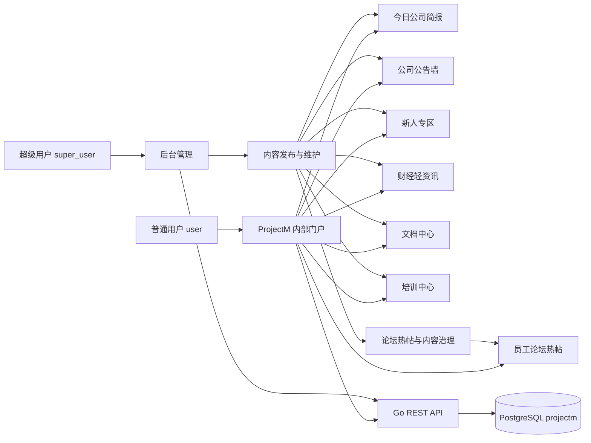
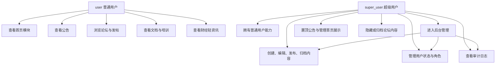
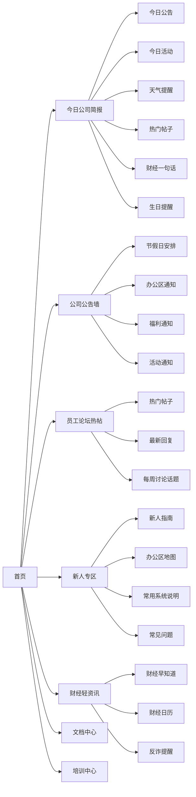
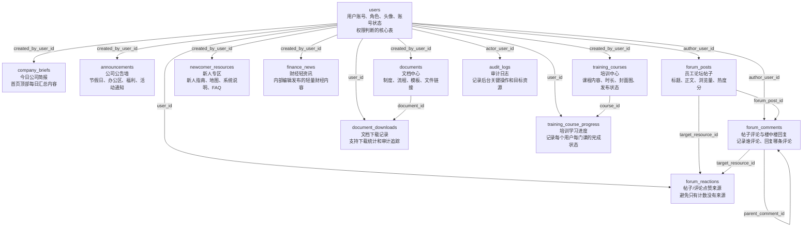
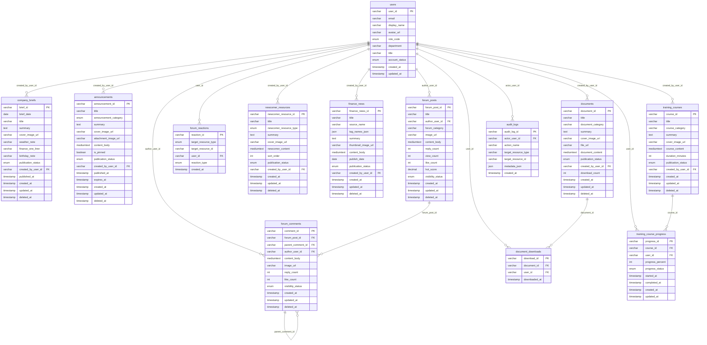
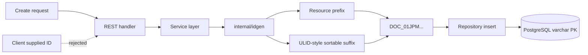
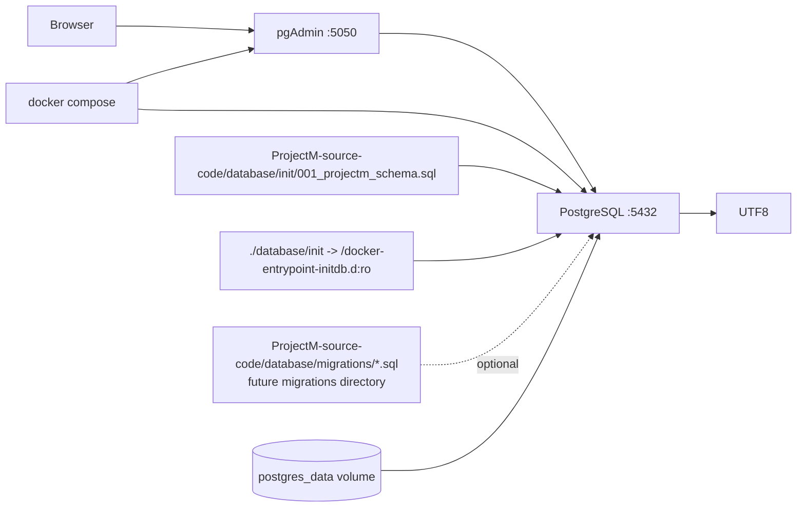
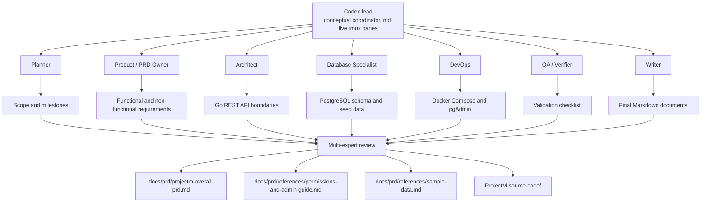
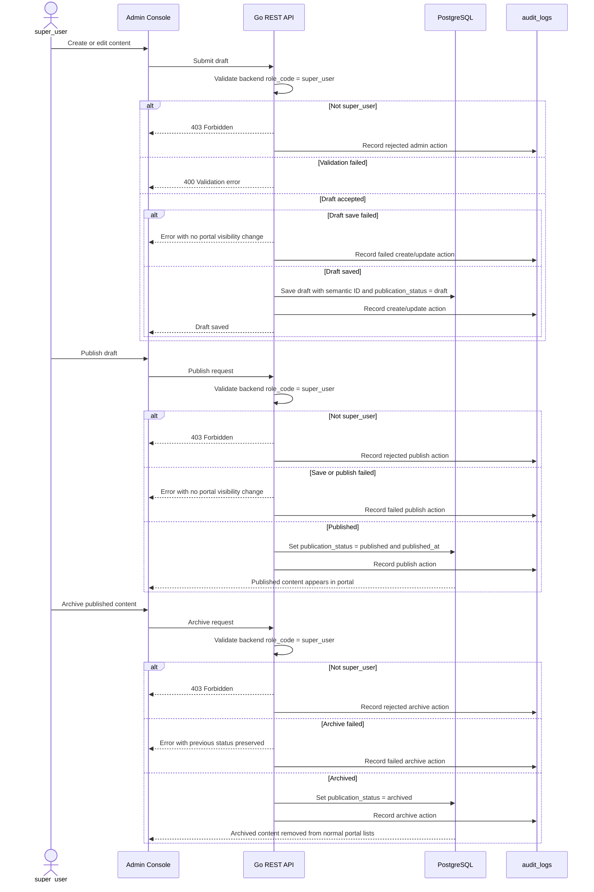

# ProjectM Diagrams

This document uses Mermaid diagrams so the PRD, database, Docker setup, and
agent workflow can be reviewed visually in Markdown-supported tools.

Scope note: these diagrams are a visual companion to the ProjectM planning
documents and the current `ProjectM-source-code` PostgreSQL/Docker baseline. They do
not claim that the React frontend or Go backend implementation is complete.

## 1. System Overview

## 2. Role Permissions

## 3. Homepage Modules

## 4. Database ERD

### 4.1 Table Responsibility Map

This diagram explains what each database table is responsible for before showing
the field-level ERD.

### 4.2 Field-Level ERD

### 4.3 Table Function Notes

| Table | Business Function | Main User | Important Notes |
| --- | --- | --- | --- |
| `users` | Stores employee accounts, display names, avatars, role code, department, title, and account status. | `user`, `super_user` | Only two roles are allowed: `user` and `super_user`. Backend authorization should check `role_code`. |
| `company_briefs` | Stores the daily company brief shown at the top of the homepage. | `super_user` creates, all users read | One brief per day through `brief_date`; includes weather, finance one-liner, birthday note, and cover image. |
| `announcements` | Stores company notices such as holidays, office notices, benefits, and events. | `super_user` creates, all users read | Supports pinned notices, cover image, attachment image, and publish/archive workflow. |
| `forum_posts` | Stores forum posts used by the homepage hot-post module. | `user` can author, `super_user` moderates | Uses `reply_count`, `view_count`, `like_count`, and `hot_score`; counts are cache fields, not the source of truth. |
| `forum_comments` | Stores comments and nested replies for forum posts. | `user` comments, `super_user` moderates | `parent_comment_id` supports one-level or nested reply UI; `author_user_id` records who commented. |
| `forum_reactions` | Stores likes for posts and comments. | `user` reacts, `super_user` audits if needed | Unique constraint prevents the same user from liking the same target repeatedly. |
| `newcomer_resources` | Stores default newcomer content such as guides, maps, system instructions, food tips, FAQ, and intro wall items. | `super_user` manages, newcomers read | Uses `sort_order` to control display order; old employees may hide the module later. |
| `finance_news` | Stores internally edited finance light-news content. | `super_user` creates, all users read | No external auto-scraping in MVP; no investment advice, stock recommendation, or return promise. |
| `documents` | Stores document-center entries, summaries, file URLs, and optional content text. | `super_user` manages, all users read | `file_url` is reserved for PDFs, templates, policies, and downloadable files. |
| `document_downloads` | Stores explicit document download events. | `user` downloads, `super_user` audits | This is an action log, not passive browsing history. |
| `training_courses` | Stores training-center courses, summaries, cover image, content, duration, and publish status. | `super_user` manages, all users read | Can support onboarding training and security training before a full LMS is built. |
| `training_course_progress` | Stores each user's progress for each training course. | `user` studies, `super_user` reviews completion | Unique `(user_id, course_id)` avoids duplicate progress records. |
| `audit_logs` | Stores key admin actions for traceability. | `super_user` reviews | Records actor, action, target resource type, target ID, and metadata JSON. |

ID convention:

- Business tables use semantic string primary keys instead of auto-incrementing numeric IDs.
- Format: `<PREFIX>_<ULID-like suffix>`, for example `TRN_01JPM000000000000000001A`.
- Prefix examples: `USR`, `BRF`, `ANN`, `FPO`, `FCM`, `FRE`, `NWR`, `FIN`, `DOC`, `DLD`, `TRN`, `TCP`, `AUD`.

## 5. Semantic ID Design

## 6. Docker Runtime

## 7. Conceptual Agent Collaboration

## 8. Admin Content Publishing Flow

